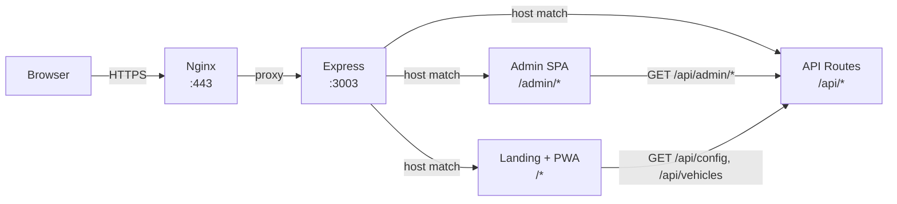
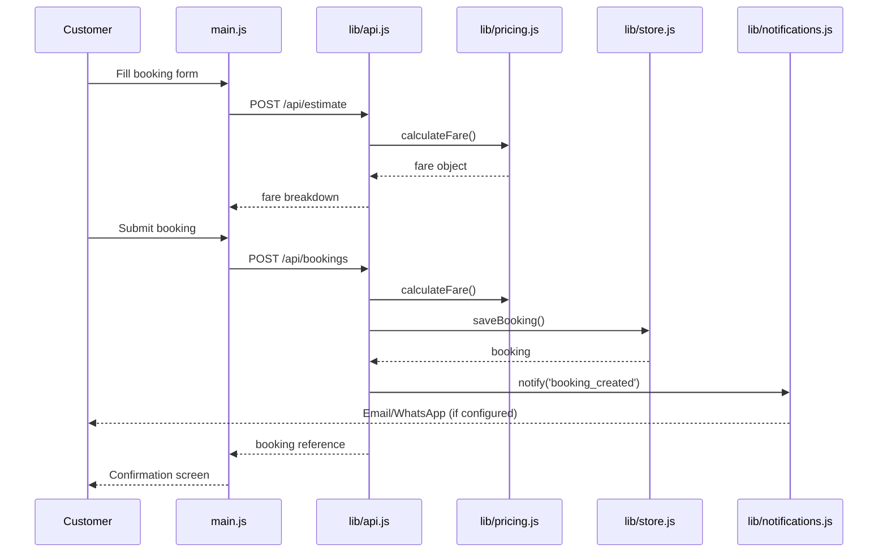

# Architecture

> Verified against actual code as of commit `15e4184`. Describes current implementation.

## Overview

STB is a Node.js/Express monolithe serving three subdomains from a single process:

```
admin.singaporetourbooking.com  →  Admin SPA (public/admin/index.html + app.js)
api.singaporetourbooking.com    →  REST API (server.js routes mounted at /api)
singaporetourbooking.com        →  Customer landing + booking (public/index.html + main.js)
```

## Request Flow

```
Client → Nginx (HTTPS termination) → Express server.js
                                   → Host-based routing (check hostname)
                                     ├─ admin.*    → serve public/admin/ static
                                     ├─ api.*      → mount /api/* routes
                                     └─ default    → serve public/ static (landing + PWA)
```

## Layered Architecture

```
Routes (server.js / lib/api.js)
  ↓
Middleware (auth, RBAC, validation, security headers, rate-limit)
  ↓
Services (lib/vehicles.js, lib/pricing.js, lib/booking.js, lib/notifications.js, ...)
  ↓
Database / Integrations (lib/db.js, lib/providers/*)
```

### Route handlers
- `server.js` — main entry, host routing, static serving, booking creation/assignment/health
- `lib/api.js` — all `/api/*` admin and customer endpoints (auth, bookings, vehicles, drivers, pricing, integrations, notifications, RBAC, content)
- `lib/handlers.js` — server-rendered HTML pages (booking form, confirmation, driver assignment)

### Service layer
| File | Responsibility |
|------|---------------|
| `lib/auth.js` | Admin login, OTP, session, password reset |
| `lib/customerAuth.js` | Customer registration, login, session |
| `lib/rbac.js` | Roles, permissions, admin user management |
| `lib/vehicles.js` | Vehicle type CRUD |
| `lib/pricing.js` | Dynamic fare calculation, surcharges, route overrides |
| `lib/booking.js` | Booking status lifecycle |
| `lib/store.js` | Booking persistence |
| `lib/bookingStatus.js` | Status transitions, driver assignment |
| `lib/notifications.js` | Notification routing to channels |
| `lib/providers/*.js` | Provider adapters (email✓, SMS✗, WhatsApp✗, payment✗, firebase✗, efc✗) |
| `lib/settings.js` | System/booking/brand settings |
| `lib/integrations.js` | Integration config CRUD with encrypted secrets |
| `lib/security.js` | Password hashing, token generation, AES-256-GCM encryption |
| `lib/ratelimit.js` | In-memory login/OTP rate limiter |
| `lib/audit.js` | Audit logging |
| `lib/drivers.js` | Driver CRUD |

## Data Flow

```
Admin edits vehicle/pricing/content
  → POST/PUT /api/admin/*  (lib/api.js)
    → Service function (lib/vehicles.js etc.)
      → lib/db.js (PostgreSQL)
        → NOTIFY /api/vehicles (public cache invalidation implicit)

Customer loads homepage
  → GET / (public/index.html)
    → public/src/main.js fetches /api/config, /api/vehicles, /api/content
      → lib/api.js public endpoints
        → lib/vehicles.js / lib/settings.js
          → PostgreSQL
```

## Subdomain Routing (server.js:26-58)

```javascript
const ROOT_DOMAIN  = process.env.ROOT_DOMAIN  || "singaporetourbooking.com"
const ADMIN_HOST   = process.env.ADMIN_HOST   || "admin." + ROOT_DOMAIN
const API_HOST     = process.env.API_HOST     || "api." + ROOT_DOMAIN
const COOKIE_DOMAIN = process.env.COOKIE_DOMAIN || ROOT_DOMAIN
```

**Issue**: These fallbacks are hardcoded strings. If env vars are misconfigured, cookie domain and routing will be wrong.

## Session/Cookie Architecture

- Admin auth: HTTP-only cookie `stb_admin_session`, domain=`COOKIE_DOMAIN`, `sameSite=lax`
- Customer auth: HTTP-only cookie `stb_session`, domain=`COOKIE_DOMAIN`, `sameSite=lax`
- CORS allowlist: `http://admin.localhost:3003`, `http://api.localhost:3003`, `https://admin.singaporetourbooking.com`, `https://api.singaporetourbooking.com`
- `credentials: 'include'` sent for cross-origin requests

## Environment Variables

Key environment variables (see `.env.example`):

| Variable | Purpose |
|----------|---------|
| `DATABASE_URL` | PostgreSQL connection string |
| `STB_SECRET_KEY` | AES-256-GCM encryption key (must be 32 hex chars) |
| `ROOT_DOMAIN` / `ADMIN_HOST` / `API_HOST` / `COOKIE_DOMAIN` | Subdomain routing |
| `SMTP_*` | Email delivery |
| `NEXT_PUBLIC_GOOGLE_MAPS_API_KEY` | Client-side Maps/Places/Routes |
| `GOOGLE_SERVER_API_KEY` | Server-side Google API calls |
| `INITIAL_ADMIN_EMAIL` | Bootstrap super-admin account |
| `SESSION_SECRET` | Express session (if used) |

## Deployment

- Single `npm run dev` process on VPS port 3003
- Nginx reverse-proxies subdomains to port 3003 (see `deploy/nginx.conf`)
- No pm2/cluster documented — single process
- Migrations run via `npm run db:migrate` (`node scripts/migrate.js`)

## Mermaid: Request Flow



## Mermaid: Booking Flow


