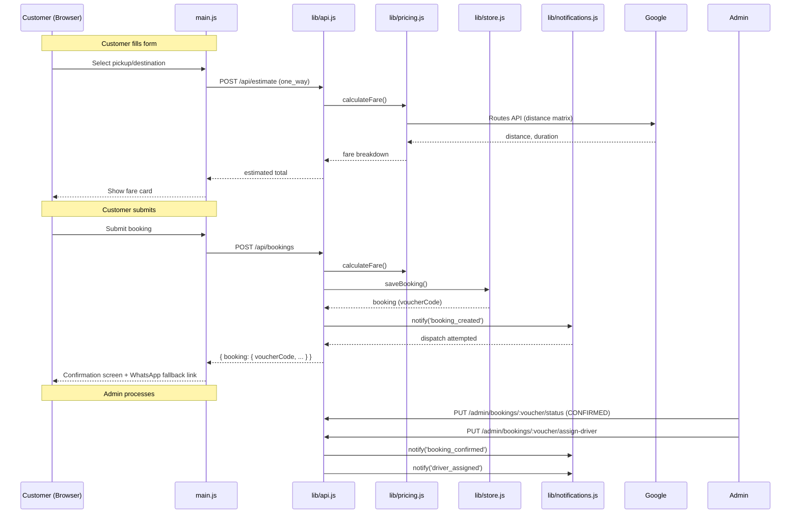

# Booking Flow

> Verified against `lib/api.js` (POST /api/bookings), `lib/pricing.js`, `lib/store.js`, `lib/handlers.js`, `public/src/main.js` as of commit `15e4184`.

## Booking Modes

### One Way
Pickup → Destination. Distance/duration from Google Routes API or Haversine fallback.

### Hourly
Pickup + Date/Time + Duration (hours). Server calculates `hourly_rate × hours`.

### Daily
Service details + Duration (days). Server calculates `daily_rate × days`.

## Mermaid: Full Booking Sequence



## Fare Calculation (lib/pricing.js)

1. **Mode detection**: `getNormalizedBookingMode(input)` → `one_way` | `hourly` | `daily`
2. **Vehicle pricing rule**: Look up `pricing_rules` by vehicle + place IDs + mode
3. **Distance**: Google Routes API distance matrix, or Haversine fallback
4. **Surcharges**: Fetch active surcharges from DB, apply by type
5. **Time-based pricing**: Check if pickup time falls in peak hours
6. **Min fare**: Apply minimum fare floor if calculated < minimum
7. **Return**: `{ baseFare, perKmRate, kmFare, surcharges[], tolls, totalFare }`

**Critical**: All fare calculation is server-side. Client receives pre-calculated `estimatedTotal`. Client-submitted prices are NEVER trusted.

## Voucher Code Generation

Server generates `STB-YYYYMMDD-RRRR` where `RRRR` is a random 4-char alphanumeric. Stored as `bookings.voucher_code` (unique index).

## Duplicate Submission Protection

No idempotency key currently implemented. If client times out after server creates booking, retry may create duplicate. **Known gap — should be addressed in Phase 8.**

## Booking Status Lifecycle

```
PENDING → CONFIRMED → ASSIGNED → IN_PROGRESS → COMPLETED
    ↓           ↓          ↓
 CANCELLED  CANCELLED  CANCELLED
```

See `lib/bookingStatus.js` for state machine rules.

## Guest vs Authenticated

| Field | Guest | Authenticated |
|-------|-------|---------------|
| customer_id | NULL | From session |
| Name/email/phone | From form | From form (pre-fill from profile) |
| Booking history | None | Via /api/customer/bookings |
| Notifications | Via guest contact fields | Via account contact fields |

## WhatsApp Fallback

When `POST /api/bookings` returns non-ok or network failure, `main.js` constructs a `wa.me` URL pre-filling a booking message with all details. This is the documented fallback path — if API fails, the WhatsApp message is the last resort to capture the booking.

**Issue**: If WhatsApp also fails (number wrong, app not installed), booking is lost.

## Known Gaps

| Issue | Impact | Phase |
|-------|--------|-------|
| No idempotency key | Duplicate bookings on timeout retry | Phase 8 |
| No server-side pricing session lock | Price could change between estimate + booking | Phase 8 |
| WhatsApp number hardcoded in 4 places | Single point of failure for fallback | Phase 4 |
| Booking timer is client-side only | No server enforcement of availability window | Phase 5 |
